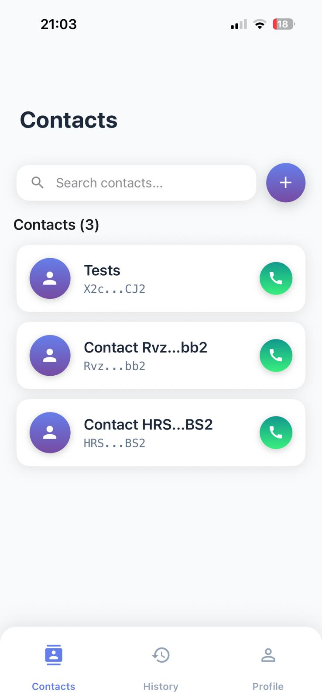
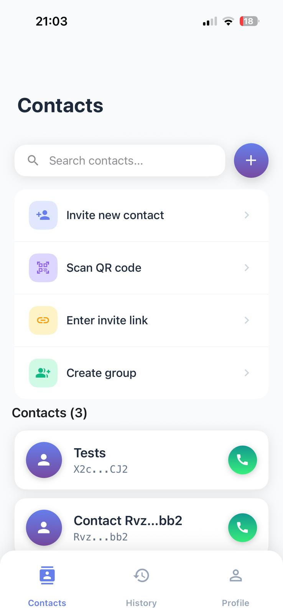

# PrivacyCall

Privacy-first audio calling app with anonymous authentication and end-to-end encrypted calls.

## App Interface

<p align="center">
  
  
</p>

## Overview

**PrivacyCall** is a React Native (Expo SDK 51) application that provides secure, private audio calling without collecting personal data. Built with Firebase backend and LiveKit Cloud for WebRTC audio.

### Key Features

✅ **Anonymous Authentication** - No registration, no personal data
✅ **Audio Calls** - 1:1 and group calls with LiveKit WebRTC
✅ **Invite System** - QR codes and links with automatic expiry
✅ **Push Notifications** - FCM for incoming calls (iOS & Android)
✅ **Mutual Contacts** - Two-way contact management
✅ **Usage Tracking** - Monitor call minutes with quota system
✅ **Privacy-Focused** - Contacts stored locally, server data auto-deletes

### Other Additions

- ✅ Mutual contact deletion (delete on one device → removed from both)
- ✅ Group management (edit/delete groups)
- ✅ iOS earpiece routing (calls default to earpiece, not speaker)
- ✅ Optimistic invite UI (instant create/delete)
- ✅ Auto-startup (direct to Contacts, no welcome screen)
- ✅ Confirmed sync deletion (no ghost contacts after app reinstall)
- ✅ Comprehensive Firestore security rules
- ✅ Call timeout handling with cancellation notifications

---

## Quick Start

### Prerequisites

- Node.js 16+
- Firebase account
- LiveKit Cloud account
- Expo account (for builds)
- Xcode (iOS) or Android Studio (Android)

### Installation

1. **Clone and install**:
   ```bash
   git clone <your-repo-url>
   cd PrivacyCall
   npm install --legacy-peer-deps
   ```

2. **Set up accounts** (see SETUP_GUIDE.md for details):
   - Create Firebase project
   - Create LiveKit project
   - Configure environment variables

3. **Install iOS dependencies**:
   ```bash
   cd ios && pod install && cd ..
   ```

4. **Run the app**:
   ```bash
   npm run ios      # iOS
   npm run android  # Android
   ```

**For detailed setup instructions**, see [SETUP_GUIDE.md](./SETUP_GUIDE.md)

---

## 🆕 Getting Started
- **[SETUP_CHECKLIST.md](./SETUP_CHECKLIST.md)** - Start here! Step-by-step setup guide
- **[SETUP_GUIDE.md](./SETUP_GUIDE.md)** - Detailed Firebase/LiveKit account setup
- **[KNOWN_ISSUES.md](./KNOWN_ISSUES.md)** - Current limitations and workarounds

### Quick Reference
```bash
# Install dependencies
npm install --legacy-peer-deps
cd ios && pod install && cd ..

# Configure YOUR credentials
cp app.json.example app.json        # Edit with YOUR values
cp .firebaserc.example .firebaserc  # Edit with YOUR Firebase project ID
cp functions/.env.example functions/.env  # Edit with YOUR LiveKit credentials
# Add YOUR Firebase config files:
# - ios/GoogleService-Info.plist
# - android/app/google-services.json

# Deploy backend
firebase deploy --only functions
firebase deploy --only firestore:rules

# Run the app
npm run ios      # iOS
npm run android  # Android
```

### Key Architecture Points
- **Service Layer Pattern**: All data operations go through `src/services/`
- **Local-First Storage**: Contacts in AsyncStorage, server data is temporary
- **Privacy Compliance**: 15-minute auto-delete for all server relationships
- **Edge Cases Handled**: Rapid cancellation, multiple calls, old notifications, etc.

### Development Workflow
1. Make changes to code
2. Test on physical devices (notifications don't work well on simulators)
3. Deploy backend changes: `firebase deploy --only functions`
4. Check logs: `firebase functions:log`

### Getting Help
- Check [KNOWN_ISSUES.md](./KNOWN_ISSUES.md) for current limitations
- Review [CLAUDE.md](./CLAUDE.md) for implementation details
- Read inline code comments in `src/services/` files
- Check commit history: `git log --oneline --graph`

---

## Project Structure

```
PrivacyCall/
├── App.js                 # Main app router, initialization
├── index.js               # Entry point, background message handler
├── src/
│   ├── services/          # Core business logic
│   │   ├── AuthService.js           # Firebase Anonymous Auth
│   │   ├── ContactsService.js       # Contact management, invites
│   │   ├── FirebaseService.js       # Firebase integration
│   │   ├── LiveKitService.js        # Audio calling (LiveKit)
│   │   └── NotificationService.js   # FCM push notifications
│   ├── screens/           # UI components
│   │   ├── ContactsScreen.js        # Main contacts list
│   │   ├── CallScreen.js            # Active call UI
│   │   ├── IncomingCallScreen.js    # Incoming call UI
│   │   ├── HistoryScreen.js         # Call history
│   │   ├── ProfileScreen.js         # Settings, usage
│   │   └── ...
│   ├── config/
│   │   └── AppConfig.js             # App constants
│   └── utils/
│       └── validation.js            # Zod schemas
├── functions/
│   ├── src/index.js       # Cloud Functions (15 functions)
│   └── .env.example       # Template for credentials
├── firestore.rules        # Security rules
└── firebase.json          # Firebase configuration
```

---

## Core Technologies

- **React Native**: 0.74.5
- **Expo SDK**: 51
- **Firebase**: Auth, Firestore, Functions, Messaging
- **LiveKit**: React Native SDK 2.9.1 for WebRTC audio
- **React Navigation**: 6.x (Stack + Bottom Tab)
- **AsyncStorage**: Local data persistence

---

## Development

**Note**: This project uses **local builds** via Xcode/Android Studio (not EAS Cloud builds).

### Running the App

```bash
# iOS (builds locally via Xcode)
npm run ios

# Android (builds locally via Gradle)
npm run android

# Specific iOS device
npm run ios -- --device "iPhone 15 Pro"

# Start Metro bundler (auto-starts with above commands)
npm start
```

**First build**: 10-15 minutes (compiles native modules)
**Subsequent builds**: 2-3 minutes

### Key Commands

```bash
# Deploy Firebase Functions
firebase deploy --only functions

# Deploy Firestore Rules
firebase deploy --only firestore:rules

# Deploy Everything
firebase deploy

# View Function Logs
firebase functions:log

# Clean iOS Build
cd ios && rm -rf build Pods && pod install && cd ..

# Clean Android Build
cd android && ./gradlew clean && cd ..
```

### Testing Checklist

- [ ] Create invite and accept on second device
- [ ] Make 1:1 call (test audio both directions)
- [ ] Create group and make group call
- [ ] Delete contact (verify mutual deletion)
- [ ] Delete and reinstall app (verify no ghost contacts)
- [ ] Test on physical devices (not just simulators)

---

## Architecture Overview

### Data Flow

**Contacts:**
- Stored locally in AsyncStorage (never on server)
- Temporary `contact_relationships` on server (auto-delete after sync)
- Mutual deletion notifies both parties

**Calls:**
- LiveKit WebRTC rooms with E2EE
- Server tracks sessions for usage/quota
- FCM notifications for incoming calls

**Invites:**
- Created in Firestore with 15-minute expiry
- Optimistic UI (instant create/delete)
- QR codes + shareable links

### Key Services

**LiveKitService** - Audio calling
- iOS earpiece routing (fixes loudspeaker default)
- Room management
- Audio track subscription handling
- Ghost call prevention

**ContactsService** - Contact management
- Local storage (AsyncStorage)
- Mutual sync via Firestore relationships
- Confirmed sync deletion (no ghost contacts)
- Group membership management

**NotificationService** - Push notifications
- FCM integration
- Background message handling
- Multiple simultaneous calls detection

**FirebaseService** - Backend integration
- Cloud Function calls
- Firestore operations
- Usage tracking

---

## Security & Privacy

### Data Minimization

- ✅ Only anonymous UIDs stored
- ✅ No names, phone numbers, or personal info
- ✅ Contacts stored locally only
- ✅ Server relationships auto-delete after sync
- ✅ No analytics or tracking

### Security Features

- ✅ Firestore security rules enforce access control
- ✅ Cloud Functions validate all inputs (Zod schemas)
- ✅ LiveKit tokens server-side only (never exposed to client)
- ✅ End-to-end encrypted audio (LiveKit E2EE)

---

## Known Limitations

See [KNOWN_ISSUES.md](./KNOWN_ISSUES.md) for current limitations.

Key limitations:
- Speaker toggle doesn't work (iOS limitation - requires native module)
- iOS simulator doesn't receive foreground notifications (test on device)
- Firestore eventually consistent (rare sync delays possible)

---

## Documentation

- **[SETUP_GUIDE.md](./SETUP_GUIDE.md)** - Complete account setup walkthrough
- **[KNOWN_ISSUES.md](./KNOWN_ISSUES.md)** - Current limitations and workarounds
- **[firestore.rules](./firestore.rules)** - Database security rules (heavily commented)
- **[ARCHITECTURE.md](./ARCHITECTURE.md)** - full breakdown of the app's architecture
